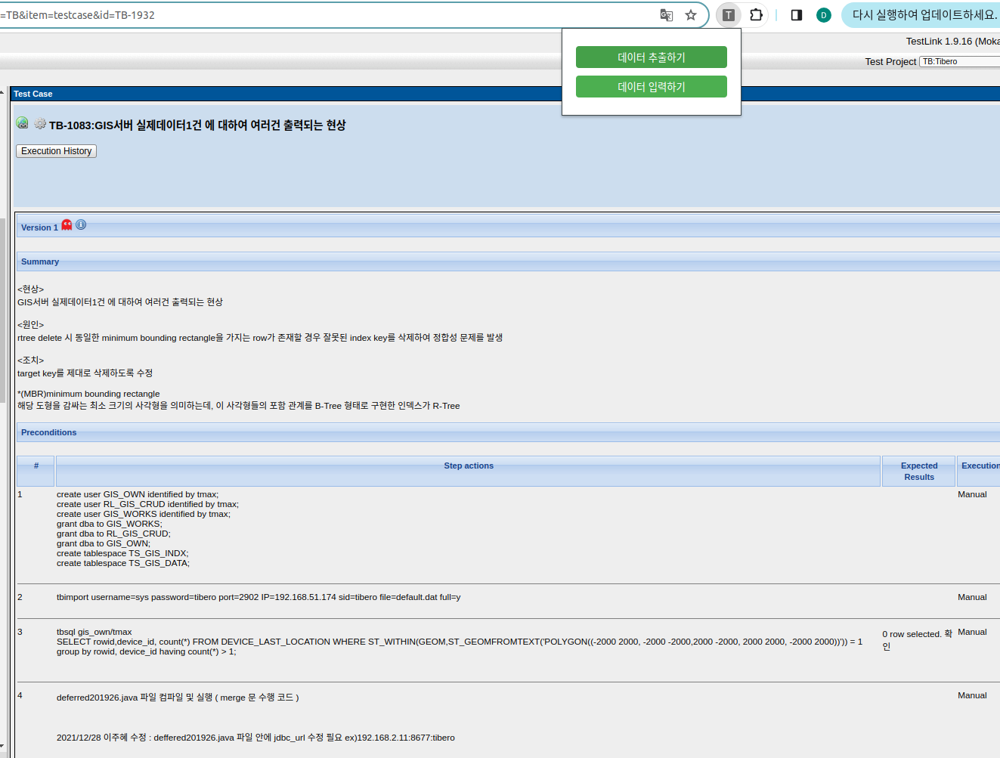
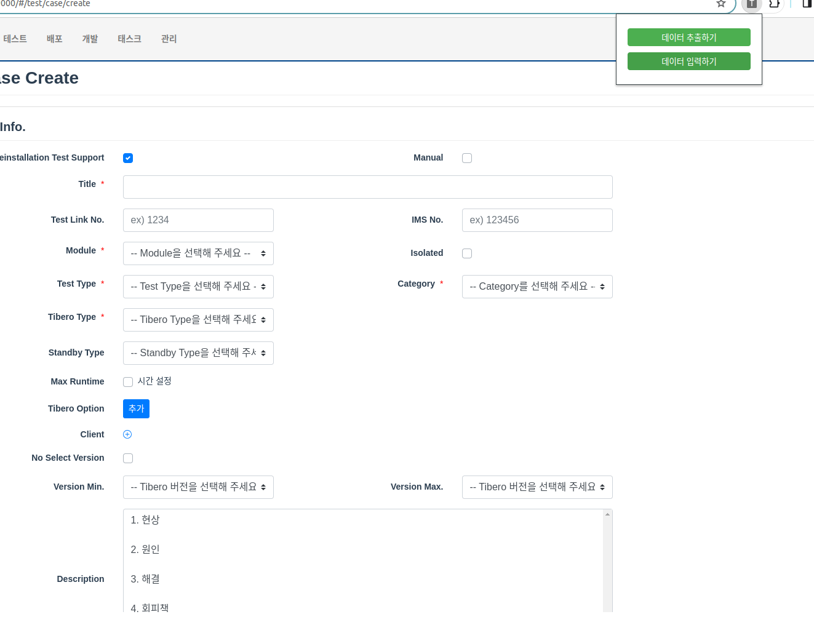
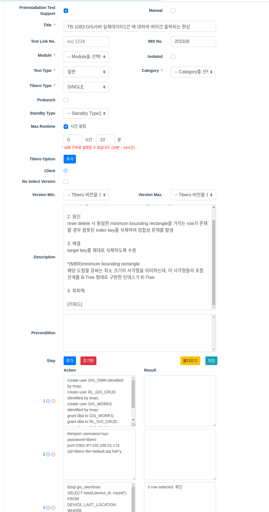
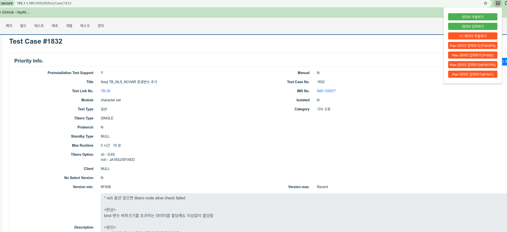
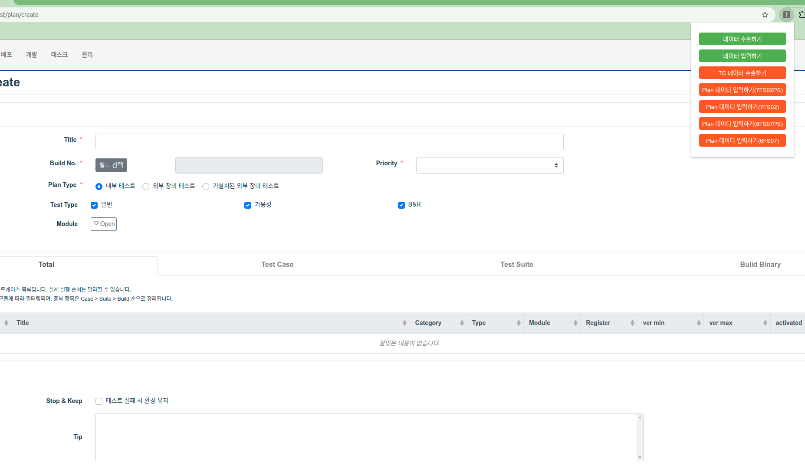

### 사용법


1. 해당 압축 파일을 압축 풀기
2. <chrome://extensions/> 에 들어가서 우측상단 개발자 모드 ON
3. 좌측상단 **압축해제된 확장 프로그램을 로드합니다.** 클릭
4. 압축푼 extension 디렉토리를 선택
5. TestLink 페이지로 가서 익스텐션 아이콘 클릭 → 데이터 추출하기

   1. **데이터가 성공적으로 추출되었습니다. 라는 팝업이 떠야함.**
   2. 안뜨면 몇 번 더 누르기

6. TLeft의 Test Case Create 페이지로 이동해서 익스텐션 아이콘 클릭 → 데이터 입력하기

   1. **데이터가 성공적으로 입력되었습니다. 라는 팝업이 떠야함.**
   2. 안뜨면 몇 번 더 누르기

7. 결과 확인

- Module과 Category는 TestLink에 있는 데이터가 아니라 복붙되지 않습니다.

- Summary의 형태가 현상, 원인, 해결이 아니면 정상적으로 복붙되지 않을 수 있습니다.

- Min. Max. 버전은 테스트 후에 수동으로 넣으셔야 합니다.

### 추가 사용법 (1.1)

* 버전 1.1부터는 TLeft에 생성한 TestCase 페이지에서 정보를 가져다가 TestPlan을 쉽게 생성할 수 있음
* TestPlan을 생성하고자 하는 TestCase 페이지에서 TestCase 추출 버튼을 누른 후, TestPlan 생성 페이지에 가서 원하는 버전으로 정보를 붙여넣으면 됨

- 잘못된 정보가 들어가는 경우가 간혹 있기 때문에, 항상 붙여넣기 후에 제대로 된 정보가 들어있는지 확인하셔야 됩니다.

- TestPlan 페이지는 처음 열린 상태 그대로여야 하며, 변경이 있는 경우 오류가 발생할 수 있습니다.
- 

### 추가 사용법 (1.2)

* 버전 1.2부터는 하나씩 데이터를 입력하는 방식이 제거되고,

   \[6FS07, 6FS07PS, 7FS02, 7FS02PS\] 4가지 바이너리에 대한 PLAN이 모두 생성되도록 변경됨.

  
* 사용법은 1.1버전과 동일하며, 다만 특정 바이너리만 선택해서 추가하는 기능이 제거됨. (필요 시 다시 추가해서 사용)

  
* 1.1버전에서는 타이밍 이슈로 인해서 test case가 잘못 생성되는 경우가 있었지만,  해당 이슈가 수정됨.

  build 선택 & test case에 대한 api를 직접 호출해서 값을 넣으므로 잘못 들어가지 않음

문제 확인 중 

```
Plan 데이터 입력하기 이후, 

Title: TC {testcase num}
BuildNo: 277758     

로 고정되나, 


실제로  Plan 생성시에는 
Title:  {입력 Title} (version)

BuildNo: 각 버전별 build No로 들어감 
```


```
api spec이 변경되거나(v1.2)

fe쪽에서 vue 컴포넌트 수정하는 경우(v1.2, v1.1, v1.0)
extension이 정상동작하지 않을 수 있으므로 참고.

```


Chrome 구버전의 경우 1.2 버전 부터 동작하지 않으므로, 

만약 동작하지 않으면 Linux기준 다음과 같이 Chorme 최신 버전으로 업데이트 필요 

```python
sudo sh -c 'echo "deb [arch=amd64] http://dl.google.com/linux/chrome/deb/ stable main" >> /etc/apt/sources.list.d/google-chrome.list'

wget -q -O - https://dl.google.com/linux/linux_signing_key.pub | sudo apt-key add -

sudo apt update

sudo apt install google-chrome-stable

google-chrome --version
```


이후 다음과 같이 크롬 확인 

설정 -> 도움말


1\.2.1 → 테스트 케이스 화면에서 plan 입력 (안되면 페이지 캐쉬 날리고 (새로고침)) 하거나 크롬 버전 확인 또는 2번 눌러보면 됨..  


이후 plan 일괄 생성하면됨 

tc→ plan 로직 수정하려면 아래꺼 풀어서 내용 수정후 번들링해서 익스텐션에 inject.bundle.js 대신에 넣어주면됨.

### extension 1.2.2 업데이트

* 6 FS06 Base 바이너리 추가

